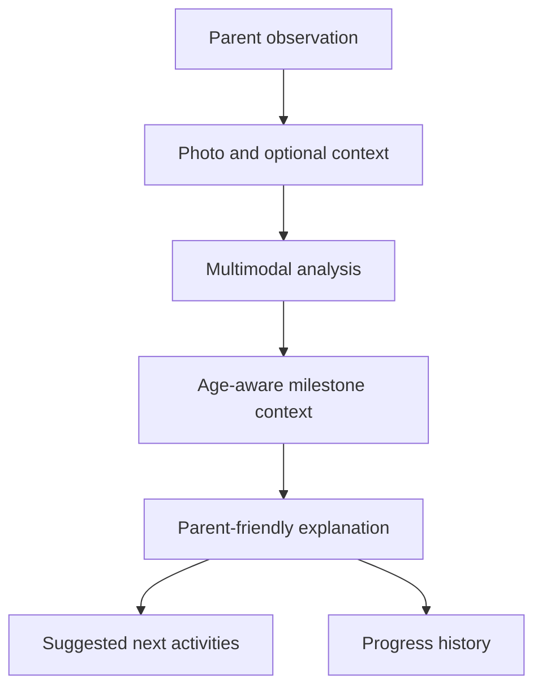

# ChildLens AI

> A mobile-first experience that helps parents understand their child's developmental progress from everyday observations.

ChildLens AI is an early-stage product prototype for parents and caregivers. It explores how a simple photo and an optional note could be transformed into clear, age-aware guidance: what a child appears to be practicing, what may come next, and which safe activities a caregiver can try at home.

The goal is to make developmental tracking feel less like paperwork and more like a helpful, ongoing conversation.

## Why ChildLens

Developmental guidance is available, but using it consistently can be difficult. Traditional milestone trackers often depend on parents remembering milestones, interpreting broad descriptions, and completing long checklists.

ChildLens is designed around a lower-friction workflow:

1. Capture or upload an everyday photo.
2. Add optional context, such as “tummy time after a nap.”
3. Review an easy-to-understand developmental summary.
4. See possible next steps and age-appropriate activities.
5. Save the observation to build a developmental history over time.

## Prototype experience

This repository contains the user-interface prototype for the ChildLens experience. It is intended to demonstrate the product direction and validate the core parent journey before production AI, clinical review, and secure data infrastructure are introduced.

The broader product vision includes:

- Photo-assisted observation of posture, movement, and activity
- Optional voice or text context from a parent or caregiver
- Milestone guidance informed by recognized developmental frameworks, including CDC milestone guidance
- Clear explanations of what may be progressing and what to observe next
- Personalized, pediatrician-reviewed activity suggestions
- A longitudinal history that helps caregivers notice change over time
- Simple, supportive language designed to reduce anxiety—not create it

## Product principles

### Parent-first

Every interaction should be quick, understandable, and useful during a busy day. ChildLens should minimize manual data entry and avoid clinical jargon.

### Explain, do not merely score

The experience should communicate the *what*, *why*, and *when* behind an observation. A result is useful only when a caregiver understands what it means and what they can do next.

### Progress over comparison

Children develop at different rates. ChildLens is designed to highlight patterns and progress over time—not rank one child against another.

### Responsible by design

Child photos and developmental information are exceptionally sensitive. A production implementation must use explicit consent, strong access controls, encryption, minimal data retention, transparent AI behavior, and carefully reviewed safety language.

## Intended AI workflow



AI-generated observations should be treated as supportive information, not definitive developmental assessments. The product should communicate uncertainty, avoid diagnosis, and provide clear escalation guidance when a parent has a concern.

## Prototype scope

This is an exploratory prototype. Depending on the current build stage, screens and data may be mocked and workflows may not yet be connected to production services.

Before public release, the product will require:

- Validation with parents, caregivers, pediatric professionals, and child-development specialists
- A clinically reviewed milestone and activity content model
- Evaluation for model accuracy, bias, uncertainty, and unsafe recommendations
- A privacy and security architecture appropriate for children's data
- Accessibility, localization, observability, and production reliability work
- Legal and regulatory review for the markets in which the product operates

## Running the UI locally

Prerequisites:

- Node.js 20 or later
- npm

```bash
git clone https://github.com/PrashantP89/ChildLens.git
cd ChildLens/web
npm install
npm run dev
```

Open the local URL printed by the development server.

Other useful commands may include:

```bash
npm run build
npm run lint
```

Refer to `package.json` for the scripts supported by the current version of the prototype.

## Direction of travel

The near-term focus is to validate the smallest useful experience:

- Make capture and contextual input effortless
- Produce an understandable observation summary
- Show why the observation matters for the child's current stage
- Recommend a small number of safe, practical activities
- Let parents track meaningful changes without maintaining a manual journal

Longer term, ChildLens could help caregivers prepare better questions for pediatric visits and build a clearer record of development across everyday moments.

## Responsible-use notice

ChildLens is not a medical device and does not provide medical advice, diagnosis, or treatment. Prototype output must not be used to determine whether a child has a developmental delay or other medical condition. Parents and caregivers should consult a qualified pediatric healthcare professional whenever they have questions or concerns about a child's health or development.

## Status

**Early prototype — not for clinical or production use.**

Feedback from product reviewers, parents, pediatric professionals, privacy specialists, and engineers is welcome as the concept evolves.

## Ownership

